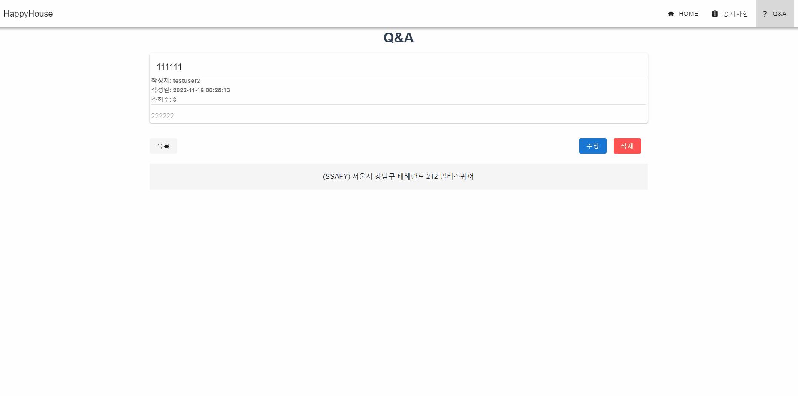
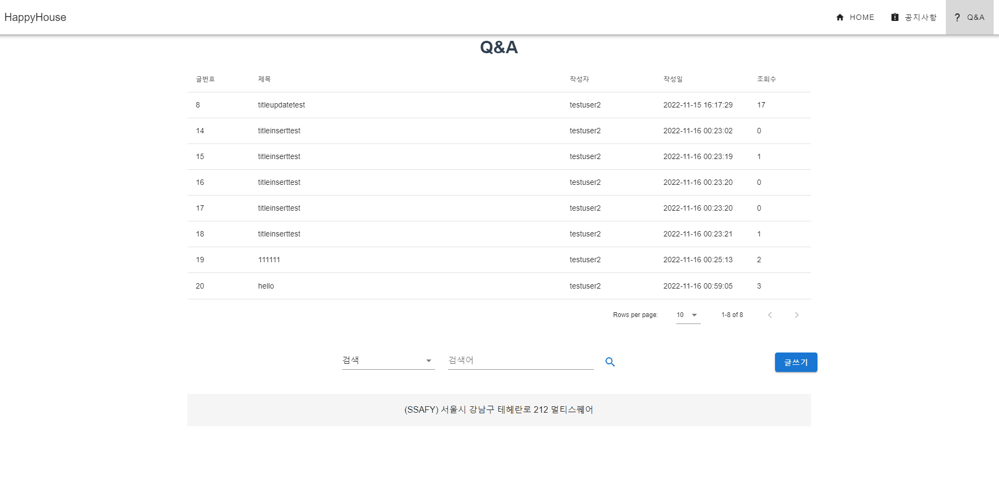
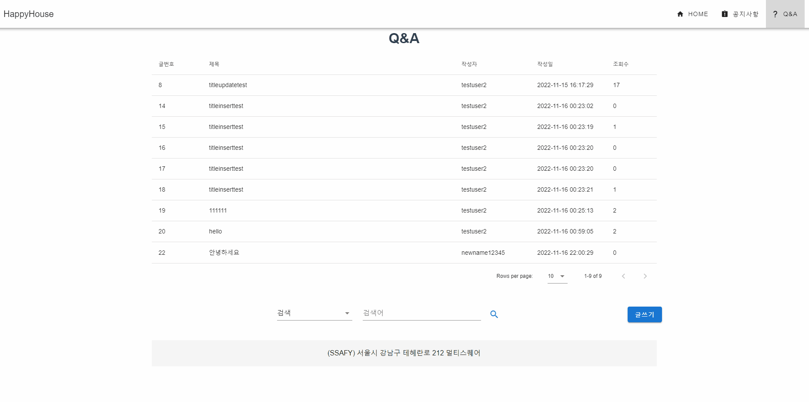
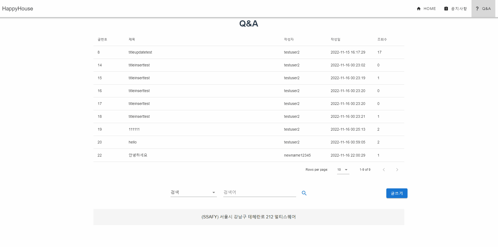
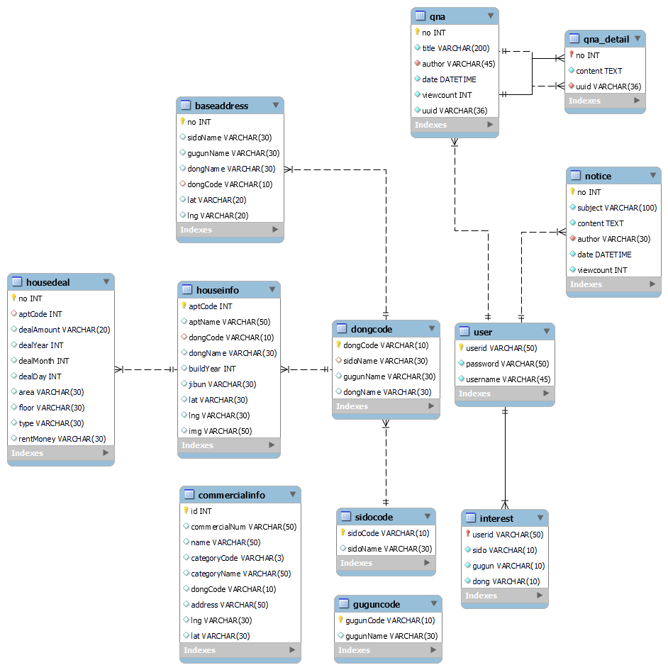

# 🏆7th PJT “구해줘 홈즈”

## 🖥️ 프로젝트 소개

> _주택 거래 데이터 분석 프로젝트_
>
> 🏠**구해줘 홈즈**🏠

## 🛠️ 사용 기술

- Javascript, Vue.js, Vuetify
- Java, Spring Boot, Mybatis, MySQL

**협업 툴**

- GitLab

## 🪜 단계별 구현

| 구현 기능                                   | 완성 여부 |
| ------                                      | ------ |
| Vue를 이용한 QnA 게시판 - 게시글 목록         | O         |
| Vue를 이용한 QnA 게시판 - 게시글 등록         | O         |
| Vue를 이용한 QnA 게시판 - 게시글 수정         | O         |
| Vue를 이용한 QnA 게시판 - 게시글 삭제         | O         |
| Vue를 이용한 QnA 게시판 - 게시글 상세 검색     | O         |
| 서버 구현 - 게시글 목록                       | O         |
| 서버 구현 - 게시글 등록                       | O         |
| 서버 구현 - 게시글 수정                       | O         |
| 서버 구현 - 게시글 삭제                       | O         |
| 서버 구현 - 게시글 상세 검색                  | O         |

## REST URL Information

| Path | Method | Description |
| ------ | ------ | ------ |
| /api/qna | GET | QnA 목록 조회 |
| /api/qna | POST | QnA 등록 |
| /api/qna/{글번호} | GET | QnA 상세 정보 조회 |
| /api/qna/{글번호} | POST | QnA 수정 |
| /api/qna/{글번호} | DELETE | QnA 삭제 |
| /api/qna?title={keyword} | GET | QnA 상세 검색 - 제목 |
| /api/qna?author={keyword} | GET | QnA 상세 검색 - 작성자자 |

## 📌 주요 기능

### # 1 QnA 게시판 - 게시글 목록 조회

### # 2 QnA 게시판 - 게시글 등록

### # 3 QnA 게시판 - 게시글 수정

### # 4 QnA 게시판 - 게시글 삭제

### # 5 QnA 게시판 - 게시글 상세 정보 조회

### # 6 QnA 게시판 - 게시글 상세 검색

### # 7 Database Diagram

### 🔗 Links

---

- Gitlab

[SSAFY](https://lab.ssafy.com/movebxeax/whereismyhome08_7)
